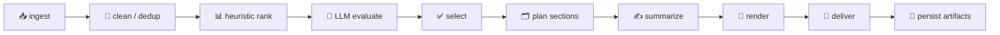

<div align="center">

# ☀️ Daily Brief Agent

**Your personal, local-first morning digest — collected, ranked, summarized, and delivered automatically.** 📰✨

*Pull from arXiv, GitHub, Hacker News & RSS → dedupe → rank → summarize → email or chat. Every morning. On autopilot.*

<br/>


</div>

---

## 📚 Table of Contents

- [✨ Why Daily Brief?](#-why-daily-brief)
- [🧠 How it works](#-how-it-works)
- [🚀 Quick start](#-quick-start-pick-one)
- [📦 Where does my data live?](#-where-does-my-data-live)
- [🧰 Command reference](#-command-reference)
- [📥 Sources](#-sources)
- [📤 Delivery channels](#-delivery-channels)
- [🤖 Summarization providers](#-summarization-providers)
- [⚙️ Configuration](#️-configuration)
- [🖥️ Web dashboard](#️-web-dashboard)
- [⏰ Scheduling & automation](#-scheduling--automation)
- [📧 Gmail setup](#-gmail-setup) · [🔔 Feishu setup](#-feishu-setup)
- [🗂️ Project layout](#️-project-layout)
- [🧪 Development](#-development)
- [☁️ Deployment](#️-deployment)
- [🔭 Roadmap](#-roadmap)
- [🔐 Secrets & notes](#-secrets--notes)
- [📄 License](#-license)

---

## ✨ Why Daily Brief?

> 🎯 **One command. Zero secrets. A clean morning digest.**

Stop doom-scrolling five feeds before coffee. Daily Brief is a **deterministic batch pipeline** (not a flaky multi-agent maze) that does the boring part for you:

| 💎 | Highlight | What it means for you |
|----|-----------|------------------------|
| 🏠 | **Local-first** | Runs entirely on your machine. SQLite + local files. Your data stays yours. |
| 📦 | **Zero-config demo** | `daily-brief dry-run` works on a fresh install — no API keys, no setup. |
| 🔌 | **Pluggable everything** | Sources, summarizers, and senders are swappable behind clean interfaces. |
| 🧩 | **LangGraph workflow** | Explicit, inspectable stages with typed shared state and checkpoints. |
| 🧠 | **Smart, not noisy** | Dedupe + multi-signal ranking + optional LLM evaluation = high signal. |
| 💌 | **Beautiful output** | Responsive HTML email with a plaintext fallback, ready to send. |
| 🛡️ | **Safe by default** | Duplicate-send protection, retries with backoff, structured JSON logs. |
| 🐳 | **Run anywhere** | pipx, pip, a one-command setup script, or Docker. |

---

## 🧠 How it works

Daily Brief is orchestrated as an explicit **LangGraph** workflow with typed shared state and conditional routing:



Every run persists stage-by-stage JSON snapshots under `runs/<date>_<timestamp>_<run_id>/` and a LangGraph checkpoint at `runs/checkpoints/workflow.pkl`, so you can replay and debug any morning.

---

## 🚀 Quick start (pick one)

> 💡 The agent ships a **bundled demo sample** and a **default config**, so the zero-config `dry-run` works on any machine with **no secrets and no extra files**.

### 🅰️ pipx — recommended for end users

Installs the `daily-brief` command globally in an isolated environment.

```bash
pipx install "git+https://github.com/your-org/daily-brief-agent.git"

daily-brief dry-run     # 🧪 zero-config demo — writes a preview, sends nothing
daily-brief init        # 🛠️ scaffold ~/.daily-brief/.env you can edit
daily-brief doctor      # 🩺 readiness checks
daily-brief serve       # 🖥️ web dashboard at http://127.0.0.1:8000
```

### 🅱️ pip

```bash
pip install "git+https://github.com/your-org/daily-brief-agent.git"
# or, after publishing to PyPI:  pip install daily-brief-agent
daily-brief dry-run
```

### 🅲 Clone + one-command setup — best for development

Creates a local `.venv`, installs everything, writes `.env`, and initializes the database. Works on macOS / Linux (`setup.sh`) and Windows (`setup.ps1`); both auto-use [uv](https://docs.astral.sh/uv/) when available. ⚡

```bash
git clone https://github.com/your-org/daily-brief-agent.git
cd daily-brief-agent
make setup        # or: ./scripts/setup.sh   (Windows: ./scripts/setup.ps1)
make dry-run      # or: .venv/bin/daily-brief dry-run
```

### 🅳 Docker — no Python toolchain needed 🐳

```bash
docker compose run --rm brief dry-run   # one-off demo
docker compose up web                   # dashboard at http://127.0.0.1:8000
```

---

## 📦 Where does my data live?

Relative paths in `.env` (e.g. `var/daily_brief.db`, `runs/`) are resolved under a **home directory**; absolute paths are used as-is.

| 🧭 Situation | 🏠 Home directory used |
|---|---|
| Run inside a checkout, or an `init --here` workspace | the **current directory** |
| `pip` / `pipx` install run from any other directory | `~/.daily-brief` |
| `DAILY_BRIEF_HOME` environment variable is set | **that path** |

So a `pip`-installed copy keeps its SQLite DB, previews, and artifacts tidy in `~/.daily-brief/` instead of scattering files wherever you happen to be. 🧹

---

## 🧰 Command reference

Run any command as `daily-brief <command>` (after install / activation) or `.venv/bin/daily-brief <command>`.

| Command | 🎬 What it does |
|---|---|
| `init` | 🛠️ Scaffold a ready-to-run workspace (`.env` + sample data + DB). Use `--here` to scaffold in the current directory. |
| `init-db` | 🗄️ Create the SQLite schema. |
| `dry-run` | 🧪 Run the full pipeline **without sending** — writes an email preview. |
| `run-now` | 📨 Run one digest now and deliver via the configured provider. |
| `run-now --dry-run` | 👀 Same as `dry-run`, persists a run without sending. |
| `run-now --force` | 💪 Send even if today's brief was already delivered. |
| `preview-email` | 💌 Render HTML + plaintext previews to `var/outbox/`. |
| `backfill-date 2026-04-01` | 📆 Generate a brief for a past date (`--dry-run` / `--force`). |
| `doctor` | 🩺 Configuration & readiness checks (`--strict`, `--json`). |
| `show-config` | 🔧 Print the fully-resolved settings as JSON. |
| `show-graph` | 🕸️ Print the workflow as a Mermaid diagram. |
| `list-runs --limit 10` | 📜 Show recent run history. |
| `send-test-email` | ✉️ Send a synthetic test message via the email provider. |
| `send-test-feishu` | 🔔 Send a synthetic test message to Feishu. |
| `serve` | 🖥️ Start the web dashboard (`--host`, `--port`, `--reload`). |
| `schedule` | ⏰ Start the APScheduler loop using your configured digest time. |

---

## 📥 Sources

Enable any combination via `SOURCE_*` env vars. Each source normalizes into a shared `BriefItem` model. 🧬

| Source | env prefix | 📝 Notes |
|---|---|---|
| 📄 **File** (demo) | `SOURCE_FILE_*` | Reads a local JSON file. Default source — falls back to a bundled sample so demos always work. |
| 🔬 **arXiv** | `SOURCE_ARXIV_*` | Category + keyword filtering, Atom parsing, raw payload capture. |
| 🐙 **GitHub** | `SOURCE_GITHUB_*` | Tracked-repo events (releases / pushes / issues / PRs). Optional `GITHUB_TOKEN`. |
| 📈 **GitHub Trending** | `SOURCE_GITHUB_TRENDING_*` | Trending repositories with keyword filtering. |
| 🟧 **Hacker News** | `SOURCE_HN_*` | `top` / `new` stories with keyword filtering. |
| 📰 **RSS / Atom** | `SOURCE_RSS_*` | Multiple feeds, RSS & Atom, keyword filtering. |

> 🧭 Want GradCafe or NBA data? See the [Roadmap](#-roadmap).

### 🌉 X (Twitter) & WeChat Official Accounts — via RSS bridges

There's **no native connector** for X or WeChat 公众号 yet, but you can ingest both **today** through the `rss` source by self-hosting a bridge that exposes them as feeds. Ready-made Docker configs ship in [`deploy/`](deploy). 🐳

| Platform | Bridge | 🔑 What it needs | 📖 Guide |
|---|---|---|---|
| 🐦 **X / Twitter** | [RSSHub](https://docs.rsshub.app) | `TWITTER_AUTH_TOKEN` (cookie from a throwaway X account) | [`deploy/rsshub/README.md`](deploy/rsshub/README.md) |
| 💬 **WeChat 公众号** | [WeWe RSS](https://github.com/cooderl/wewe-rss) | Bind a 微信读书 account via QR code | [`deploy/wewe-rss/README.md`](deploy/wewe-rss/README.md) |

The flow is the same for both: 1️⃣ start the bridge with Docker → 2️⃣ it exposes feed URLs → 3️⃣ append them to `SOURCE_RSS_FEEDS` in your `.env`:

```dotenv
SOURCE_RSS_ENABLED=true
SOURCE_RSS_FEEDS=https://openai.com/news/rss.xml,http://localhost:1200/twitter/user/OpenAI,http://localhost:4000/feeds/<feed_id>.atom
```

> ⚠️ Both bridges rely on logged-in sessions/tokens and carry a small account-risk — use **secondary/throwaway accounts**. A first-class `twitter_x.py` connector is on the [Roadmap](#-roadmap).

---

## 📤 Delivery channels

Choose with `EMAIL_PROVIDER`. 🚚

| Provider | value | 🔑 Setup |
|---|---|---|
| 🖨️ **Console** (default) | `console` | None — writes rendered emails to `var/outbox/`. Perfect for demos. |
| 🔔 **Feishu** (飞书) | `feishu` | Group bot webhook (`FEISHU_*`). Supports interactive cards or plain text. |
| 📧 **Gmail API** | `gmail_api` | OAuth desktop credentials (`GMAIL_*`). See [Gmail setup](#-gmail-setup). |
| ✉️ **SMTP** | `smtp` | Standard SMTP host/credentials (`SMTP_*`). |

---

## 🤖 Summarization providers

Choose with `SUMMARIZER_PROVIDER`. 🧠

| Provider | value | 💬 Notes |
|---|---|---|
| ⚡ **Extractive** (default) | `extractive` | Deterministic, **no API key needed**. Great offline default. |
| 🌐 **OpenAI-compatible** | `openai_compatible` | Any OpenAI-style endpoint (`SUMMARIZER_BASE_URL`, `SUMMARIZER_API_KEY`, `SUMMARIZER_MODEL`). |
| 🇨🇳 **GLM (智谱)** | `glm` | Zhipu GLM models, e.g. `glm-4-flash`. |

---

## ⚙️ Configuration

Everything is environment-driven via a `.env` file (and real environment variables, which take precedence). Start from the bundled defaults, the minimal [`.env.example`](.env.example), or the AI-focused [`config/example.ai-focused.env`](config/example.ai-focused.env).

<details>
<summary>🔧 <b>Configuration groups</b> (click to expand)</summary>

| Group | Prefix | ⚙️ Controls |
|---|---|---|
| App | `APP_*` | Timezone, digest hour/minute, max items, retries, scheduler grace window. |
| Database | `DATABASE_URL`, `RAW_PAYLOAD_DIR`, `OUTBOX_DIR` | SQLite location, raw payload + outbox directories. |
| Logging | `LOG_LEVEL`, `LOG_JSON` | Log verbosity and JSON vs. text logs. |
| HTTP | `HTTP_*` | Timeout, retries, user agent, raw payload persistence. |
| Sources | `SOURCE_*`, `GITHUB_TOKEN` | Enable/disable and tune each connector. |
| Ranking | `RANKING_*` | Scoring weights, topic/priority keywords, per-topic & total limits. |
| Summarizer | `SUMMARIZER_*` | Provider, model, base URL, API key, temperature, timeout. |
| Workflow | `WORKFLOW_*` | Artifact root, checkpoints, candidate/selection limits, thresholds. |
| Email | `EMAIL_*` | Provider, from/to, subject prefix, preview-before-send. |
| Gmail | `GMAIL_*` | OAuth credentials/token files, user id. |
| SMTP | `SMTP_*` | Host, port, username, password, TLS. |
| Feishu | `FEISHU_*` | Webhook URL, signing secret, message type. |

</details>

A minimal AI-focused `.env` looks like this: 👇

```dotenv
APP_TIMEZONE=America/New_York
APP_DIGEST_HOUR=8

SOURCE_FILE_ENABLED=false
SOURCE_ARXIV_ENABLED=true
SOURCE_ARXIV_CATEGORIES=cs.AI,cs.LG,cs.CL
SOURCE_GITHUB_ENABLED=true
SOURCE_GITHUB_TRACKED_REPOS=openai/openai-python,huggingface/transformers,vllm-project/vllm
SOURCE_HN_ENABLED=true
SOURCE_RSS_ENABLED=true
SOURCE_RSS_FEEDS=https://openai.com/news/rss.xml,https://www.anthropic.com/news/rss.xml

SUMMARIZER_PROVIDER=extractive
EMAIL_PROVIDER=console
```

> 🔍 Run `daily-brief show-config` any time to see the fully-resolved settings, and `daily-brief doctor` to validate them.

---

## 🖥️ Web dashboard

```bash
daily-brief serve --host 127.0.0.1 --port 8000
```

Then open **http://127.0.0.1:8000**. The dashboard 🪟:

- 📰 shows the latest rendered brief,
- 📜 lists recent runs,
- ▶️ lets you trigger a new run (dry-run or send) from the browser,
- 🔬 exposes each run's workflow-stage artifacts on its detail page.

It's a thin presentation layer over `DailyBriefPipeline` and reads the same runs, digests, and `runs/` artifacts the CLI produces.

---

## ⏰ Scheduling & automation

### 🔁 Built-in scheduler

Uses `APP_TIMEZONE`, `APP_DIGEST_HOUR`, and `APP_DIGEST_MINUTE`.

```bash
daily-brief schedule
```

### 🗓️ Local cron

Recommended for a single always-on machine.

```cron
0 8 * * * cd /path/to/daily-brief-agent && .venv/bin/daily-brief run-now >> var/cron.log 2>&1
```

### 🛡️ Duplicate-send protection

- ✅ A successful non-dry-run delivery for the same local target date **blocks** subsequent sends.
- 💪 Use `--force` to override.
- 🧪 Dry runs never count as sent deliveries.

```bash
daily-brief run-now
daily-brief run-now --force
daily-brief backfill-date 2026-04-01 --force
```

---

## 📧 Gmail setup

The Gmail sender uses OAuth desktop credentials and stores a refresh token locally. 🔐

1. ☁️ In Google Cloud, enable the **Gmail API**.
2. 🪪 Configure the OAuth consent screen.
3. 🖥️ Create an OAuth client for a **Desktop app**.
4. ⬇️ Download the client JSON to `credentials.json` (or set `GMAIL_CREDENTIALS_FILE`).
5. ⚙️ Set `EMAIL_PROVIDER=gmail_api` in `.env`.
6. 👀 (Optional) Run `daily-brief preview-email` to inspect output first.
7. 🚀 Run `daily-brief run-now`. The first send opens a local OAuth flow and writes a token to `var/gmail_token.json`.

📖 Docs: [Gmail Python quickstart](https://developers.google.com/workspace/gmail/api/quickstart/python) · [Sending mail](https://developers.google.com/workspace/gmail/api/guides/sending) · [`users.messages.send`](https://developers.google.com/workspace/gmail/api/reference/rest/v1/users.messages/send)

## 🔔 Feishu setup

1. 🤖 Create a **custom group bot** in your Feishu group and copy its webhook URL.
2. ⚙️ Set in `.env`:
   ```dotenv
   EMAIL_PROVIDER=feishu
   FEISHU_ENABLED=true
   FEISHU_WEBHOOK_URL=https://open.feishu.cn/open-apis/bot/v2/hook/your-hook-id
   FEISHU_SECRET=                 # optional, for signature verification
   FEISHU_MESSAGE_TYPE=interactive   # interactive (card) or text
   ```
3. ✅ Test it: `daily-brief send-test-feishu`.

---

## 🗂️ Project layout

```text
src/daily_brief/
├── cli.py              # 🧰 Typer CLI entrypoint
├── scheduler_entry.py  # ⏰ APScheduler entrypoint
├── main.py             # ▶️ run_once orchestration helper
├── config/             # ⚙️ typed settings + path resolution
├── sources/            # 📥 arXiv, GitHub, HN, RSS, file connectors
├── aggregation/        # 🧹 dedup, ranking, topic grouping, assembly
├── ranking/            # 📊 scoring
├── summarization/      # ✍️ provider abstraction + adapters
├── llm/                # 🧠 reasoning prompts, schemas, providers
├── graph/              # 🕸️ LangGraph nodes, state, checkpoints, artifacts
├── rendering/          # 🎨 HTML / text / markdown rendering
├── delivery/           # 📤 console, Feishu, Gmail, SMTP senders
├── orchestration/      # 🔧 pipeline, options, doctor
├── storage/            # 💾 SQLAlchemy models + repository
├── models/             # 🧬 BriefItem, DailyBrief, Digest, RunRecord
├── web/                # 🖥️ FastAPI dashboard
├── resources/          # 📦 bundled sample data + default .env
└── logging/            # 🪵 structured JSON logging
```

---

## 🧪 Development

Convenience `make` targets run everything through a local `.venv` — no global install needed. 🛠️

| Target | 🎯 Purpose |
|---|---|
| `make setup` | Full one-command setup (venv + install + `.env` + init-db). |
| `make install` | Create venv and install with dev deps. |
| `make dry-run` | Run the pipeline without sending. |
| `make serve` | Start the web dashboard. |
| `make doctor` | Readiness checks. |
| `make test` | Run the pytest suite. ✅ |
| `make lint` | Run `ruff`. 🧹 |
| `make typecheck` | Run `mypy --strict`. 🔎 |
| `make check` | Lint + typecheck + tests. 🚦 |
| `make clean` / `make distclean` | Remove caches / also the venv. |

Run the quality gate directly:

```bash
.venv/bin/ruff check src tests
.venv/bin/mypy src
.venv/bin/pytest
```

---

## ☁️ Deployment

| Target | 👍 Good for | ⚠️ Watch out |
|---|---|---|
| 🖥️ **Local cron** | A single always-on machine. Lowest overhead, easiest to debug. | Machine must be on at digest time. |
| 🤖 **GitHub Actions** | Scheduled one-shot runs with API-backed sources. | Bad fit for Gmail desktop OAuth & local filesystem state. |
| 🐳 **Cloud job** (Cloud Run / Railway / Fly.io) | Long-term, hands-off scheduled container. | Move SQLite → Postgres, outbox → object storage, use managed secrets. |

**Before going cloud:** 🚧 move SQLite to Postgres, relocate raw payloads/outbox to object storage, use managed secrets, and switch delivery to SMTP or non-interactive auth.

---

## 🔭 Roadmap

Planned source-integration notes live in [`docs/next-sources.md`](docs/next-sources.md):

- 🐦 Twitter / X — *works today via the [RSSHub bridge](#-x-twitter--wechat-official-accounts--via-rss-bridges); a native `twitter_x.py` connector is planned.*
- 💬 WeChat 公众号 — *works today via the [WeWe RSS bridge](#-x-twitter--wechat-official-accounts--via-rss-bridges); a native connector is planned.*
- 🎓 GradCafe / forums
- 🏀 NBA data sources

Other upgrades on the radar: 🗃️ Alembic migrations, 🐘 Postgres, 📦 object storage, 🔭 OpenTelemetry/Sentry, 🧮 semantic dedupe with embeddings.

---

## 🔐 Secrets & notes

- 🤐 Secrets live **only** in `.env` or real environment variables.
- 🙈 `.env`, `credentials.json`, and `var/` are gitignored by default (see [`.gitignore`](.gitignore)).
- 🖨️ Default sender is `console`; default source is `file` (bundled sample fallback).
- 💾 Every run saves intermediate snapshots and final artifacts under `runs/`.
- 🧷 LangGraph checkpoints persist at `runs/checkpoints/workflow.pkl`.
- 🐙 GitHub "trending" is intentionally **not** the MVP path — tracked repository events are the stable default.

---

## 📄 License

Released under the **MIT License**. 🆓 Use it, fork it, ship your mornings. ☕

<div align="center">

**Built for people who'd rather read one great brief than scroll ten feeds.** 🌅

⭐ If this saves you time, consider starring the repo!

</div>
